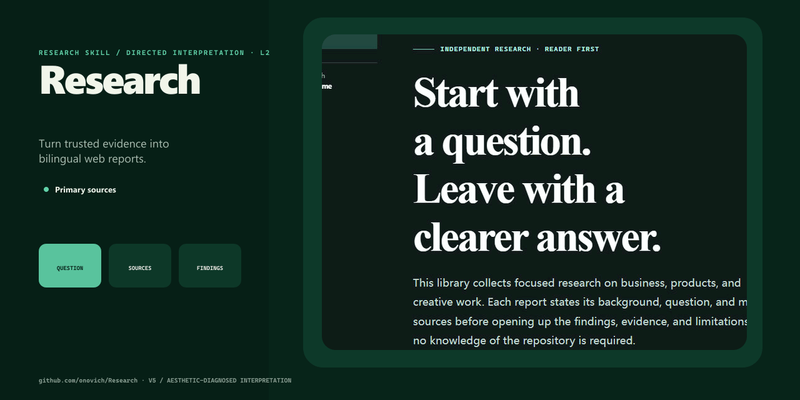

# RepoCover

[English](README.md)

[官网](https://repo-cover.onovich.com/zh/) · [案例](https://repo-cover.onovich.com/zh/examples/) · [GitHub Social Preview 指南](https://repo-cover.onovich.com/zh/github-social-preview-guide/)

## 关于

很多程序员更擅长把项目做出来，却不擅长把它介绍清楚。我自己也一样。AI 编程让做出更多项目变得越来越容易，而让别人愿意多看一眼，或许也有意义。

于是，就有了 RepoCover。我花了一天时间做的，看上去还不赖，我自己先用了。


## RepoCover 能做什么

RepoCover 是一个开源 AI 编程 Skill。它会先读懂代码仓库，再为它设计 GitHub Social Preview，并输出可编辑的 SVG 和精确的 `1280×640`、小于 1 MB 的 PNG。

- **先读项目，再做设计：** 先看 README、代码、界面和项目素材，再决定封面应该展示什么。
- **根据实际情况选择视觉方案：** 已有可运行界面、已有主视觉，以及没有合适图片的项目，需要用不同方式处理。
- **把已有素材变得更适合做封面：** 保留有辨识度的截图、插画和品牌元素，清理杂乱内容并重新构图，而不是硬塞进固定版式。
- **没有合适图片也能生成：** 必要时会根据项目真正做的事情推导视觉方向，而不是套用模板。
- **适用于本地和远端仓库：** 能在本地预览的项目，尤其是已有前端界面的 Web 项目，通常能提供更好的视觉素材。
- **符合 GitHub Social Preview 要求：** GitHub 接受小于 1 MB 的 PNG、JPG 或 GIF，建议尺寸至少为 `640×320`，并把 `1280×640` 列为最佳显示尺寸。详见 [GitHub 官方 Social Preview 文档](https://docs.github.com/zh/repositories/managing-your-repositorys-settings-and-features/customizing-your-repository/customizing-your-repositorys-social-media-preview)。

## 快速开始

打开你的 AI Agent 工具——首选 Codex——依次把下面两句话发给它：

```text
安装 https://github.com/onovich/RepoCover 的 Skill。
```

```text
使用 $repo-cover 为当前项目生成封面。
```

RepoCover 会生成：

```text
docs/social-preview.svg
docs/social-preview.png
```

生成图片不代表可以修改 README、上传图片或更改仓库设置；需要这些操作时，请再单独提出。

## 案例

[Research 完整案例](https://repo-cover.onovich.com/zh/examples/#research-case-title)展示了如何把一个可运行的双语研究网站整理成适合分享的小图，同时保留项目原本的辨识度。

[](https://repo-cover.onovich.com/zh/examples/#research-case-title)

下面还有 8 张由同一个 Skill 生成的封面。每一张都会跟随各自的项目，而不是套用同一套模板。

| PrismDraft | LittlePNG |
| --- | --- |
|  |  |

| DeskMochi | AudioTrim |
| --- | --- |
|  |  |

| Beat | JustGoal.skill |
| --- | --- |
|  |  |

| Knot | Ping |
| --- | --- |
|  |  |

## 工作原理

1. 阅读仓库，弄清楚项目是做什么的。
2. 判断已有界面、插画或其他项目素材是否适合放进一张小尺寸分享图。
3. 保留好看的部分，删除干扰内容，并补充构图真正需要的元素；没有可用图片时，就根据项目本身推导视觉方向。
4. 输出可编辑的 SVG，以及精确的 `1280×640`、小于 1 MB 的 PNG。
5. 在明暗背景下检查原尺寸和缩略图，确保分享时仍然清楚。

完整 Skill 指令位于 [`skill/repo-cover/`](skill/repo-cover/)。

## 开发

需要：

- Python 3.10+
- Node.js 20+
- 将 SVG 渲染为 PNG 时可用的 Sharp

运行仓库检查：

```text
python scripts/check.py
```

发布说明和项目检查见 [`docs/RELEASE_CHECKLIST.md`](docs/RELEASE_CHECKLIST.md)。

## 许可证

[MIT](LICENSE)

RepoCover 是独立开源项目，与 GitHub, Inc. 不存在隶属或背书关系。GitHub 是 GitHub, Inc. 的商标。
