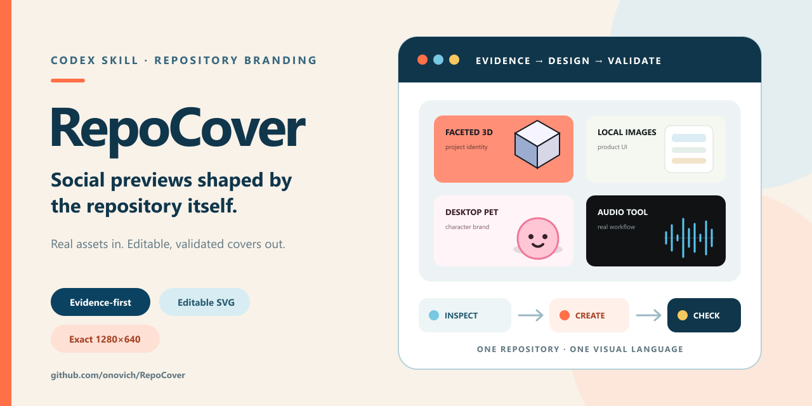
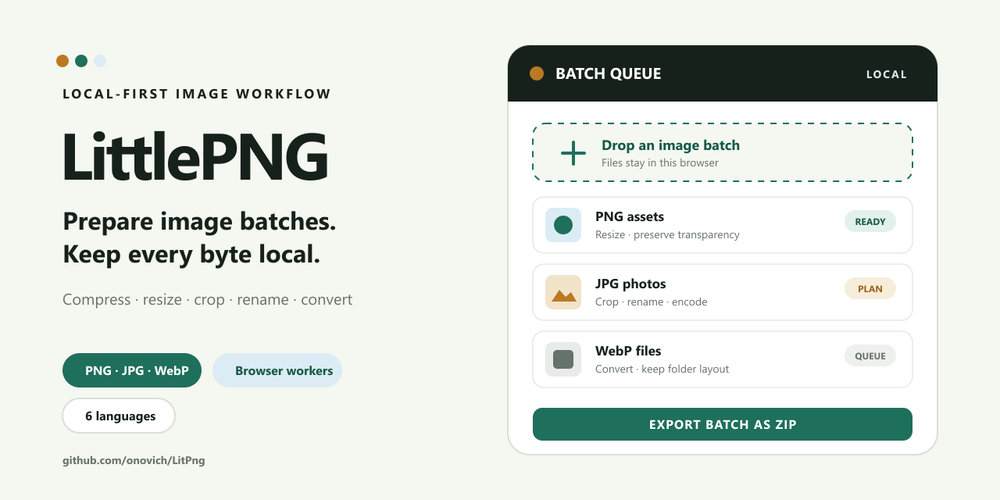
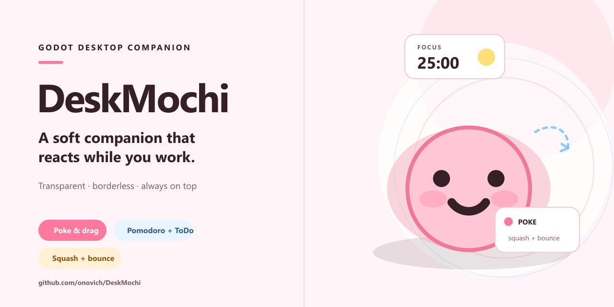
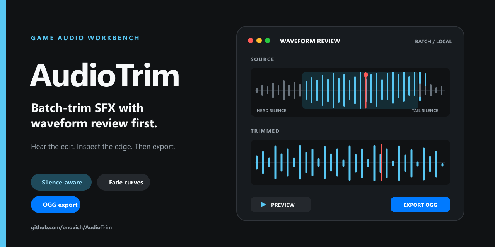
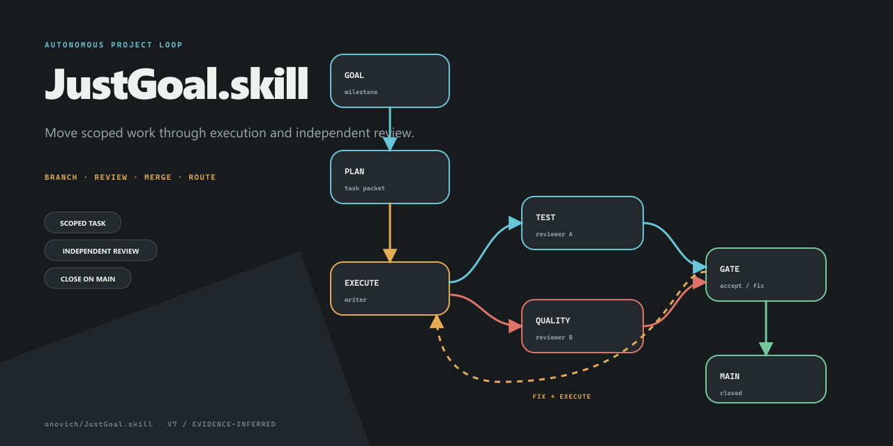
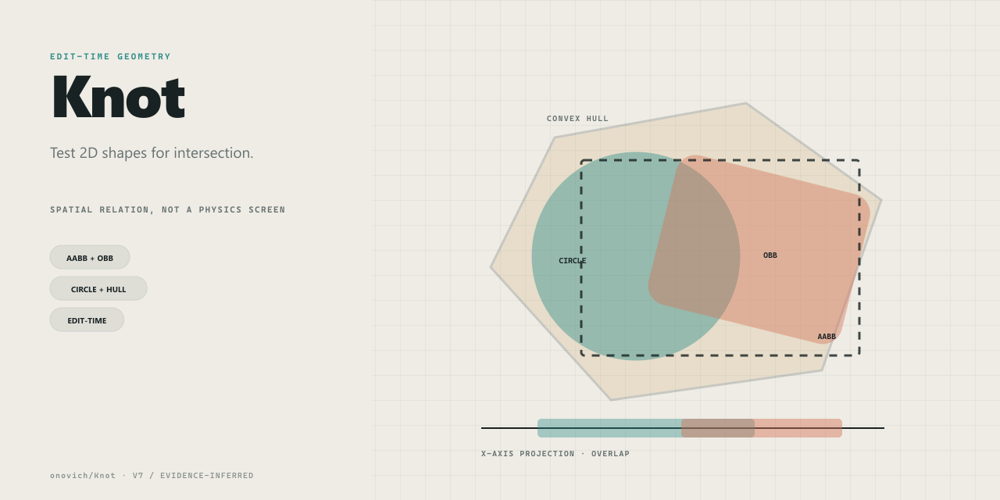

# RepoCover

[English](README.md)

先审计本地或线上仓库，再依据真实项目证据生成保留各自身份的 GitHub 社交分享预览图。

RepoCover 是一个同时适用于单仓库和仓库组合的 Codex Skill。它可以在批量生成前筛除空库和完成度极低的项目；在具备认证访问条件时，无需 clone 即可检查线上仓库；它会诊断并重组有价值的截图或项目素材，也能在没有可用主视觉时，从真实对象、动作、拓扑和结果中推导诚实的视觉系统。每个验收通过的封面都包含可编辑 SVG 和精确的 `1280×640` PNG。



## 为什么使用 RepoCover

- **支持仓库组合审计：** 批量生成前先遍历仓库，用大白话说明用途，并区分值得推广的项目、样板空库与废弃开端。
- **支持线上取证：** 无需 clone 即可检查公开仓库或已经授权访问的私有仓库，并如实标注静态取证边界。
- **只使用真实证据：** 图中的功能、状态、数据与关系必须能够由仓库内容证明。
- **尊重原始素材：** 保留有辨识度的主体和材料，删除噪声、修复构图，只补充仓库能够证明的缺漏信息。
- **支持无素材冷启动：** 没有截图、Logo 或主形象时，从对象、动作、拓扑和结果推导设计，而不是套用库存母题。
- **避免版本负优化：** 旧封面继续保留，新版本作为候选；只有通过全尺寸和缩略图对比后才会晋级。
- **可编辑且符合 GitHub Social Preview 要求：** GitHub 接受小于 1 MB 的 PNG、JPG 或 GIF，建议尺寸至少为 `640×320`，并将 `1280×640` 列为最佳显示规格。RepoCover 因此固定输出精确的 `1280×640` PNG，并在旁边保留可编辑的确定性 SVG。详见 [GitHub 官方 Social Preview 文档](https://docs.github.com/zh/repositories/managing-your-repositorys-settings-and-features/customizing-your-repository/customizing-your-repositorys-social-media-preview)。
- **默认安全：** 生成图片不代表获得 README 修改、上传或更改仓库设置的权限。

## 封面可以用在哪里

- **GitHub Social Preview：** 对公开仓库，在仓库主页打开 `Settings`，找到 `Social preview`，再依次选择 `Edit` 和 `Upload an image...`。之后把仓库链接转发到支持链接预览的社交平台或网站时，对方可以自动把这张图作为仓库封面展示。GitHub 也说明，这类图片只能从公开仓库对外分享。
- **README 与文档：** 放在 README 顶部，或作为文档首页、示例目录的横幅。
- **社交媒体与发布公告：** 用作新项目发布、版本更新、开发日志或社区帖子的配图。
- **作品集与宣传页面：** 用于个人主页、项目卡片、文章、演示文稿和其他推广材料。

仅把图片保存到仓库，并不会自动设置 GitHub Social Preview。上传图片、修改 README 和发布到其他渠道仍然是彼此独立的操作，需要分别授权。

## 为什么做 RepoCover

我知道很多程序员并不擅长包装自己的仓库，我自己也一样：喜欢埋头苦干，直到写出了三百多个几乎无人问津的仓库。在 vibe coding 大行其道的今天，我开始意识到，让走过路过的人愿意多看一眼，本身就很重要。

于是，我尝试让 AI 先读代码、理解项目，再根据它的理解生成 Social Preview。效果居然还不错。我把这套过程稍加打磨后，决定分享出来。

RepoCover 的提示词、流程与视觉规则都可以继续修改。你可以调整 prompt、`SKILL.md` 或参考规则，让它探索更丰富的风格；只要结果仍然尊重项目事实、项目身份和可读性即可。

## 快速开始

从当前仓库安装：

```text
使用 $skill-installer，从 onovich/RepoCover 的 skill/repo-cover 安装 Skill。
```

重启 Codex，然后根据任务选择一种请求。

为一个本地仓库生成：

```text
使用 $repo-cover 为这个仓库生成并验证 GitHub social preview。
```

无需 clone，直接处理线上仓库：

```text
使用 $repo-cover 在不 clone 的情况下检查这个 GitHub 仓库，并依据可获取的线上证据生成 social preview。
```

处理一批仓库：

```text
使用 $repo-cover 遍历这些仓库，用大白话说明并筛选是否值得生成；等我确认后，再生成可切换的版本化封面。
```

默认输出：

```text
docs/social-preview.svg
docs/social-preview.png
```

刷新既有封面时，RepoCover 会创建版本化兄弟文件，并在对比证明新版更好之前保留旧推荐。除非另外明确要求，否则它不会修改 README，也不会上传图片。

## 示例

最初四个便携示例覆盖了四种差异较大的仓库类型：

| PrismDraft | LittlePNG |
| --- | --- |
|  |  |

| DeskMochi | AudioTrim |
| --- | --- |
|  |  |

后续四个公开回归示例用于覆盖仓库组合测试中暴露出的典型问题：

| [Beat](https://github.com/onovich/Beat) · 音频符号化 | [JustGoal.skill](https://github.com/onovich/JustGoal.skill) · 分支工作流 |
| --- | --- |
|  |  |

| [Knot](https://github.com/onovich/Knot) · 几何关系 | [Ping](https://github.com/onovich/Ping) · 弱素材重构 |
| --- | --- |
|  |  |

这些案例刻意使用不同的材料、抽象层级、拓扑和构图语法。它们是验证样本，不是要求照抄的模板。

## 工作原理

1. 检查项目规则、原创内容、源码路径、视觉素材和可证明范围。
2. 处理仓库组合时，先逐一说明并分类，再开始大量生成。
3. 在设计账本中记录一个核心承诺、支持证据和需要排除的次要内容。
4. 对已有素材进行审美诊断；没有素材时建立冷启动语义骨架。
5. 在原生 SVG、素材混合或插画混合中选择路线，并在渲染前比较可行方向。
6. 将旧封面保留为版本化兄弟文件，同时记录拓扑、材料、素材角色、线条语义与裁片边界。
7. 检查尺寸、体积、SVG 可访问性、全尺寸构图，以及明暗背景下精确的 `320×160` 缩略图。
8. 只有在收到单独明确授权后才上传，并进一步核对公开页面的 `og:image`。

完整 Agent 指令和按场景加载的参考文件位于 [`skill/repo-cover/`](skill/repo-cover/)。

## 验证证据

当前仓库包含八张便携公开示例 PNG，以及 RepoCover 自身的产品预览图。此外，项目所有者还完成了一次覆盖 63 个可访问公开和私有仓库的版本化回归，样本包括游戏、Web 项目、开发工具、库、实用工具与 Skill。2026-08-14，这组测试中每个仓库的最新选定版本均由项目所有者验收通过。

这项结果属于所有者验收测试，不是独立第三方基准。私有仓库身份与取证素材不会打包进当前仓库。公开且去隐私化的回归约定见 [`docs/REGRESSION_BASELINE.md`](docs/REGRESSION_BASELINE.md)。

## 开发

需要：

- Python 3.10+
- Node.js 20+
- 将 SVG 渲染为 PNG 时可用的 Sharp

运行仓库检查：

```text
python scripts/check.py
```

该命令检查 metadata、无 BOM 的 UTF-8、源码语法、全部便携示例和项目自身预览图。当前状态与新会话接手说明见 [`docs/PROJECT_STATUS.md`](docs/PROJECT_STATUS.md)，发布门禁见 [`docs/RELEASE_CHECKLIST.md`](docs/RELEASE_CHECKLIST.md)。

## 许可证

[MIT](LICENSE)

RepoCover 是独立开源项目，与 GitHub, Inc. 不存在隶属或背书关系。GitHub 是 GitHub, Inc. 的商标。
